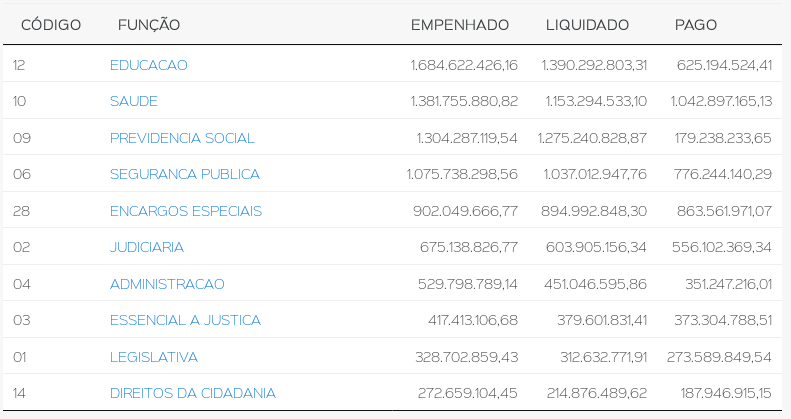
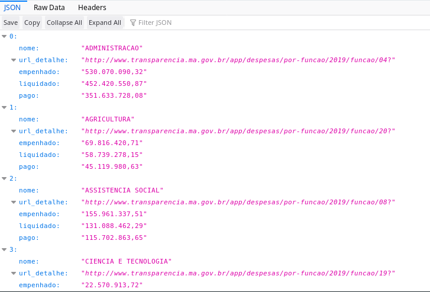
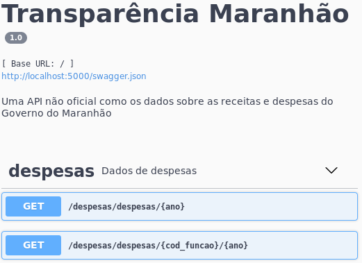
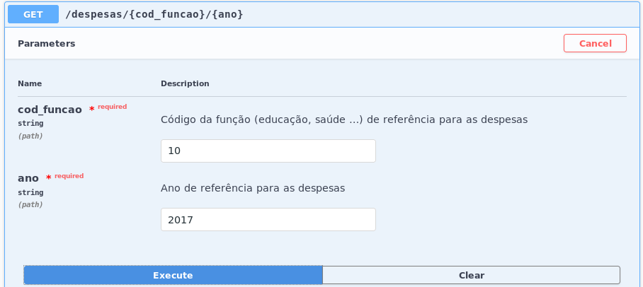
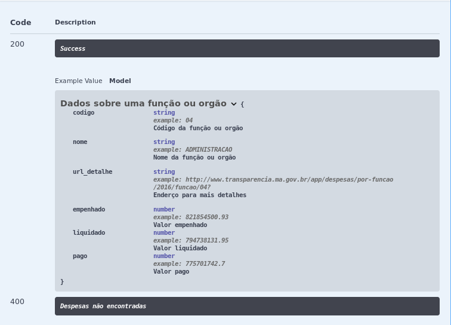
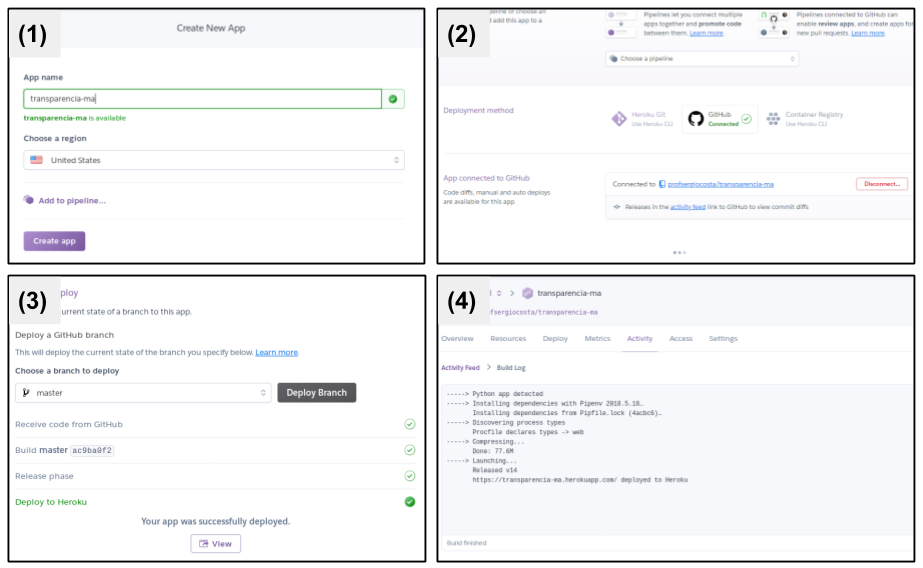
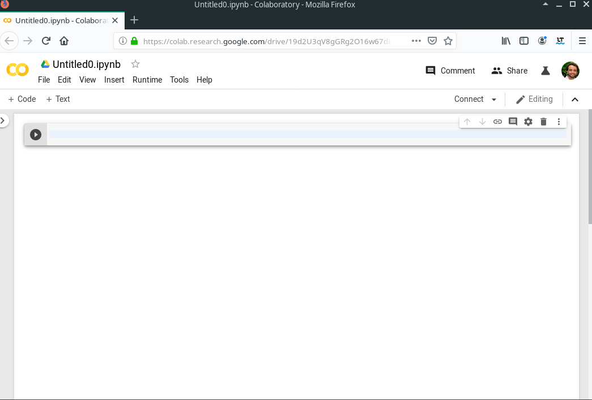
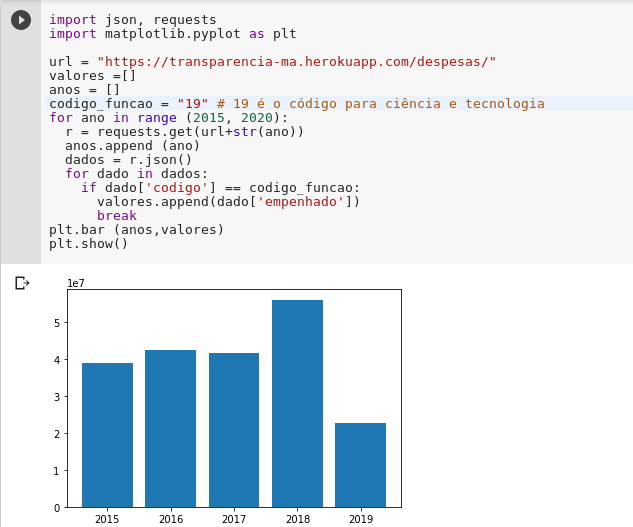

## Os cinco passos para transformar qualquer site de dados públicos em uma API de dados abertos

* Sérgio Souza Costa
* Mateus Vitor Duarte Sousa
* Micael Lopes da Silva

[Acessem aqui o Capítulo do Livro - Rascunho](minicurso_ercemapi_cap_rascunho.pdf)

---
## Roteiro

1. Introdução
2. Passo 1: Identificação e modelagem dos dados
3. Passo 2: Extração dos dados
4. Passo 3: Desenvolvimento da API
5. Passo 4: Documentação
6. Passo 5: Implantação 
7. Passo extra: Experimentando a API 
8. Considerações finais


---

## Introdução

- A Constituição de 1988 foi reforçado através Lei de Acesso à Informação (http://www.planalto.gov.br/ccivil_03/_ato2011-2014/2011/lei/l12527.htm) demanda das instituições disponibilizar os seus dados públicos.

- Dados públicos são todos aqueles sem nenhuma restrição.

- Dados abertos, por sa vez precisam seguir os seguintes princípios:    
    - ser completos, 
    - primários, 
    - atuais, 
    - acessíveis, 
    - compreensíveis por máquina,
    - não proprietários e 
    - livres de licença

- Atualmente espera-se que tudo que não for sigiloso esteja disponível na internet no formato de dados abertos, ou seja, não basta disponibilizar quando solicitado⁠

---


## Introdução

- O objetivo desse minicurso é apresentar uma solução para expor os dados públicos como dados abertos utilizando para isso a extração de dados e disponibilizá-los através de uma API implantada na plataforma Heroku.

Algo similar ao que estamos fazendo com os dados dad UFMA, onde estamos criando a seguinte API de dados abertos:

* https://dados-ufma.herokuapp.com/

Adicionalmente, um servidor de dados conectados:

* https://linked-ufma.herokuapp.com/


---
## Introdução (principais requisitos)

- Ter instalado e configurado o interpretador da Linguagem Python e o instalador de pacotes PIP (https://www.python.org/).
- Ter uma conta na Plataforma Heroku (https://www.heroku.com/).
- Ter uma conta no Github (https://github.com/).
- Ter instalado o Git (https://git-scm.com/)


---

## Introdução (principais tecnologias)

As principais tecnologias usadas são:


---


---

## Passo 1: Identificação e modelagem dos dados

- Identificar sites com dados de interesse da sociedade e que ainda não possuem APIs
- Muitos sites de instituições públicas ainda não migraram para dados abertos.
- Um exemplo é o site da transparência do governo do Estado do Maranhão http://www.transparencia.ma.gov.br.
    - Ele foi lançado em 2015 e apresenta diversas melhorias em relação ao anterior, mas ainda não disponibiliza dados abertos através de uma API. 
    - O acesso a todos os dados requer a interação entre um usuário e um navegador web.
    - Mesmo para baixar os dados, é necessário a interação com um usuário.

---

## Passo 1: Identificação e modelagem dos dados
Por exemplo, ao acessar o seguinte endereço 
* http://www.transparencia.ma.gov.br/app/despesas/por-funcao/2019#lista 

Tem se a seguinte tabela que descreve as despesas de cada função administrativa em 2019.




* Nesse site, já temos os dados bem estruturados, o que é preciso estraí-los e criar o acesso através de uma API.

* O processo de identificação dos dados poderá ser feito e refeito, a medida que exploramos o site de interesse.

Vamos para o PASSO 2 ?


---


## Passo 2: Extração dos dados

* Existem hoje diversas bibliotecas nas mais distintas linguagens capazes de executar o "web scrapping". 

* Nesse minicurso, usaremos o Python e a biblioteca beautifulsoup4.

* Vamos configurar o ambiente ?


---
## Passo 2: Extração dos dados (instalando o pipenv)

* Antes de mais nada, iremos usar o pipenv, então vamos lopo instalar.

* Abra um terminal e instale o pipenv com o seguinte comando

        $ pip install pipenv

---
## Passo 2: Extração dos dados (criando o projeto e instalando as depedências)

- Para criar o projeto, crie uma pasta chamada transparencia-ma, e nela execute o seguinte comando:

        $ pipenv --three

- Instalando as depedências básicas:

      $ pipenv install requests beautifulsoup4 lxml
    
---
## Passo 2: Extração dos dados (testando a configuração inicial)

- Antes de prosseguir, vamos ver se está tudo ok com as instalações.

- Crie um arquivo chamado `scrapper.py` com o seguinte código:

```python
import requests
from bs4 import BeautifulSoup as BS

url = "http://www.transparencia.ma.gov.br/app/despesas/por-funcao/2019#lista"
page_response = requests.get(url)
page = BS(page_response.text, 'lxml')
table = page.find ('table')
print (table)
```

- No terminal, inicialize o ambiente `pipenv` e então execute o arquivo `scrapper.py`

        $ pipenv shell
        $ python scrapper.py 
    
- Ao executar o comando acima, será impresso um codigo HTML da tabela selecionada.

```html
<tr>
<td>19</td>
<td class="secondLeft">
<a href="http://www.transparencia.ma.gov.br/app/despesas/por-funcao/2019/funcao/19?">
            CIENCIA E TECNOLOGIA
            </a>
</td>
<td>22.570.913,72</td>
<td>17.746.719,47</td>
<td>13.433.197,71</td>
</tr>
```

> >  Conseguiu executar o comando acima ? Imprimiu o HTML ? Ok, podemos seguir:

---

## Passo 2: Extração dos dados (função de extração de despesas)


- Substitua o codigo do arquivo `scapper.py` pelo código a seguir, já com a função `despesas_total`:


```python
import requests
from bs4 import BeautifulSoup as BS

def despesas_total ():
    url = "http://www.transparencia.ma.gov.br/app/despesas/por-funcao/2019#lista"
    response = requests.get(url)
    page = BS(response.text, 'lxml')
    table = page.find ('table')
    rows = table.find_all('tr')
    despesas = []
    for row in rows[1:]: 
        cols =row.find_all("td")
        despesa = {}
        despesa["nome"] = cols[1].find("a").get_text().strip()
        despesa["url_detalhe"] = cols[1].find("a").get('href')
        despesa["empenhado"] = cols[2].get_text().strip()
        despesa["liquidado"] = cols[3].get_text().strip()
        despesa["pago"] = cols[4].get_text().strip()
        despesas.append(despesa)

    return despesas

# remover o codigo abaixo
print (despesas_total())
```

---

## Passo 2: Extração dos dados (testando a função de extração de despesas)

Execute o codigo novamente, agora para testar a função de estração de despesas:

```
 $ python scrapper.py 
[{'nome': 'ADMINISTRACAO', 'url_detalhe': 'http://www.transparencia.ma.gov.br/app/despesas/por-funcao/2019/funcao/04?', 'empenhado': '530.070.090,32', 'liquidado': '452.420.550,87', 'pago': '351.633.728,08'}, {'nome': 'AGRICULTURA', 'url_detalhe': 'http://www.transparencia.ma.gov.br/app/despesas/por-funcao/2019/funcao/20?', 'empenhado': '69.816.420,71', 'liquidado': '58.739.278,15', 'pago': '45.119.980,63'}, ...]
```

> Apos este teste, remova a seguinte linha:
>
>    ```print (despesas_total()```)

> Nesse ponto, é importante que tenha executa o comando acima, e já tenha obtido como resultado os dados no formato JSON.

---

## Passo 3: Desenvolvimento da API (instalando ...)

* Depois de criado a função `despesas_total`, podemos partir para o desenvolvimento da API.

* Primeiro instale o framework flask, que será usado para criar a API:

        $ pipenv install flask-restplus
    
---

## Passo 3: Desenvolvimento da API (versão 0.001)

- Para ter uma API bem simples, crie um arquivo `app.py` com o seguinte código:

```python
from flask import Flask
from flask_restplus import Resource, Api, fields
from scrapper import despesas_total

app = Flask(__name__)
api = Api(app)

@api.route('/despesas')
class Despesas(Resource):
    def get(self):
        return despesas_total()

if __name__ == '__main__':
    app.run(debug=True)
```

- Pronto, já pode iniciar a API:

```
$ python app.py
 * Serving Flask app "app" (lazy loading)
 * Environment: production
   WARNING: This is a development server. Do not use it in a production deployment.
   Use a production WSGI server instead.
 * Debug mode: on
 * Restarting with stat
 * Debugger is active!
 * Debugger PIN: 230-864-203
 * Running on http://127.0.0.1:5000/ (Press CTRL+C to quit)
```
---

## Passo 3: Desenvolvimento da API (testando a versão 0.001)

- Podemos testar diretamente no navegador, basta entrar com o seguinte endereço http://127.0.0.1:5000/, já será retornado os dados como na figura:



---
## Passo 3: Desenvolvimento da API (versão 0.002, incluindo o ano)

- A funcao `despesa_total` está sempre retornando os dados para o ano de 2019. Podemos mudar isso, alterando ela como no código abaixo:

```python
def despesas_total (ano):
    url_base = "http://www.transparencia.ma.gov.br/app"
    url = url_base + "/despesas/por-funcao/"+ano
    response = requests.get(url)
    page = BS(response.text, 'lxml')
    table = page.find ('table')
    rows = table.find_all('tr')
    despesas = []
    for row in rows[1:]: # testando apenas com 3 linhas
        cols =row.find_all("td")
        despesa = {}
        despesa["nome"] = cols[1].find("a").get_text().strip()
        despesa["url_detalhe"] = cols[1].find("a").get('href')
        despesa["empenhado"] = cols[2].get_text().strip()
        despesa["liquidado"] = cols[3].get_text().strip()
        despesa["pago"] = cols[4].get_text().strip()
        despesas.append(despesa)

    return despesas
```

- Precisa atualizar a rota lá na API, para incluir o ano:

```python
app = Flask(__name__)
api = Api(app)

@api.route('/despesas/<string:ano>')
class Despesas(Resource):
    def get(self, ano):
        return despesas_total(ano)

if __name__ == '__main__':
    app.run(debug=True)
```

---
## Passo 3: Desenvolvimento da API (testando a versão 0.002)

- Agora os dados do ano de 2016 poderão ser acessados através da seguinte URL: http://localhost:5000/despesas/2016. 


---
## Passo 3: Desenvolvimento da API (versão 0.002, despesas por função)

- O site da transparência do Governo do Maranhão permite  visualizar os detalhes das despesas de uma dada função ou órgão administrativo. 
- Por exemplo, o código da função administrativa "educação" é 12. Então, a http://www.transparencia.ma.gov.br/app/despesas/por-funcao/2018/funcao/12 detalha como a despesa com a educação foi distribuída para cada orgão.


---

## Passo 3: Desenvolvimento da API (versão 0.003, adaptando a extração para considerar a função administrativa)

- Vamos adaptar o código do arquivo `scrapper.py` incluindo uma função que irá extrair o total das despesas e outra detalhada por função administrativa:


```python
import requests
from bs4 import BeautifulSoup as BS
def despesas_total (ano):
    url_base = "http://www.transparencia.ma.gov.br/app"
    url = url_base + "/despesas/por-funcao/"+ano
    return extrai_despesas (url)
    
def despesas_por_funcao (cod, ano):
    url_base = "http://www.transparencia.ma.gov.br/app"
    url = url_base + "/despesas/por-funcao/"+ano+"/funcao/"+cod
    return extrai_despesas (url)

def extrai_despesas (url):
    response = requests.get(url)
    page = BS(response.text, 'lxml')
    table = page.find ('table')
    rows = table.find_all('tr')
    despesas = []
    for row in rows[1:]:
        cols =row.find_all("td")
        despesa = {}
        despesa["codigo"]  = cols[0].get_text().strip()
        despesa["nome"] = cols[1].find("a").get_text().strip()
        despesa["url_detalhe"] = cols[1].find("a").get('href')
        despesa["empenhado"] = cols[2].get_text().strip()
        despesa["liquidado"] = cols[3].get_text().strip()
        despesa["pago"] = cols[4].get_text().strip()
        despesas.append(despesa)
    return despesas
   
```
---
## Passo 3: Desenvolvimento da API (versão 0.003, adicionando a nova rota)


- Para atualizar a API e a rota, primeiro importe a nova função:

```python
from scrapper import despesas_total , despesas_por_funcao
```
- Agora adiciona a seguinte rota:

```python
@api.route('/despesas/<string:cod_funcao>/<string:ano>')
class DespesasPorFuncao(Resource):
    def get(self, cod_funcao, ano):
        return despesas_por_funcao(cod_funcao, ano)
```

## Passo 3: Desenvolvimento da API (testando a nova rota)

- Caso o servidor não esteja em execução, inicie-o
- Teste a nova rota em um navegador


ou diretamente pelo console:
```
curl -X GET "http://localhost:5000/despesas/12/2018" -H "accept:application/json"
```


---
## Passo 4: Documentação

- Uma parte importante em qualquer API é uma boa documentação. Então, no quarto passo será utilizado a biblioteca Swagger
 
- A biblioteca flask-restplus vem com o suporte para o Swagger e já cria uma documentação básica ao acessar o endereço raiz da API, como na figura abaixo:


---

## Passo 4: Documentação (adicionando novas informações)

* Adicionando a versão, o nome e a descrição como informações principais da API. 

* Criando o namespaces `despesas` para agrupar as rotas. Com a evolução da API, poderia ser criado um namespace `receitas`.


```python
from flask import Flask
from flask_restplus import Resource, Api, fields
from scrapper import despesas_total, despesas_por_funcao

app = Flask(__name__)
api = Api(app = app, 
		  version = "1.0", 
		  title = "Transparência Maranhão", 
          description = "Uma API não oficial com os dados sobre as receitas e despesas do Governo do Maranhão")
          
ns = api.namespace('despesas', description='Dados de despesas')

@ns.route('/<string:ano>')
class Despesas(Resource):
    def get(self, ano):
        return despesas_total(ano)
@ns.route('/<string:cod_funcao>/<string:ano>')
class DespesasPorFuncao(Resource):
    def get(self, cod_funcao, ano):
        return despesas_por_funcao(cod_funcao, ano)

if __name__ == '__main__':
    app.run(debug=True)
```
---

## Passo 4: Documentação (documentação com as novas informações)

Com as informações adicionadas previamente, já teriamos o seguinte resultado



---

## Passo 4: Documentação (atualizando a documentação para as rotas e métodos)

Atualizando a documentação as rotas e métodos, através do decorator `api.doc`.

```python
@ns.route('/<string:ano>')
class Despesas(Resource):
    @api.doc(responses={ 200: 'OK', 400: 'Despesas não encontradas' },  params={ 'ano': 'Ano de referência para as despesas' })
    def get(self, ano):
        return despesas.despesas_total(ano)
        
@ns.route('/<string:cod_funcao>/<string:ano>')
class DespesasPorFuncao(Resource):
    @api.doc(responses={ 200: 'OK', 400: 'Despesas não encontradas' },
     params={ 'ano': 'Ano de referência para as despesas',
    'cod_funcao' : 'Código da função (educação, saúde ...) de referência para as despesas'})
    def get(self, cod_funcao, ano):
        return despesas.despesas_por_funcao(cod_funcao, ano)
```
  
Tendo como resultado:



---

## Passo 4: Documentação (atualizando os tipos de dados)

- Os metadados, são importantes para descrever os dados, incluindo tipos de dados e exemplos de valores.

- Antes de definir os metadados, vamos converter os valores liquidados, pagos e empenhados para números, pois atualmente eles estão como strings.

- Como eles estão no formato brasileiro para os números, vamos usar uma biblioteca especifica para a conversão:

        $ pipenv install babel

- Agora será necessário importar a função `parse_decimal`.

```python
    from babel.numbers import parse_decimal
 ```

 Atualizar a função `extrai_despesas`
 
 ```python
   def extrai_despesas (url):
    response = requests.get(url)
    page = BS(response.text, 'lxml')
    table = page.find ('table')
    rows = table.find_all('tr')
    despesas = []
    for row in rows[1:]:
        cols =row.find_all("td")
        despesa = {}
        despesa["codigo"]  = cols[0].get_text().strip()
        despesa["nome"] = cols[1].find("a").get_text().strip()
        despesa["url_detalhe"] = cols[1].find("a").get('href')
        despesa["empenhado"] =   parse_decimal (cols[2].get_text().strip(), locale='pt_BR')
        despesa["liquidado"] =  parse_decimal (cols[3].get_text().strip(), locale='pt_BR')
        despesa["pago"] =  parse_decimal (cols[4].get_text().strip(), locale='pt_BR')
        despesas.append(despesa)

    return despesas
```
---

## Passo 4: Documentação (atualizando os tipos de dados)

- Com a atualização dos tipos de dados, podemos criar de fato os metadados.

```python
model = api.model('Dados sobre uma função ou orgão', {
    'codigo': fields.String(description='Código da função ou orgão', example="04"),
    'nome': fields.String(description='Nome da função ou orgão', example="ADMINISTRACAO"),
    'url_detalhe': fields.String(description='Endereço para mais detalhes', example="http://www.transparencia.ma.gov.br/app/despesas/por-funcao/2016/funcao/04?"),
    'empenhado': fields.Float(description='Valor empenhado', example=821854500.93),
    'liquidado': fields.Float(description='Valor liquidado', example=794738131.95),
    'pago': fields.Float(description='Valor pago', example=775701742.7),
})
```

- Para associar o metadado aos dados retornados, será usado o `decorator` `@api.marshal_with` em ambas rotas:


```python
@ns.route('/<string:ano>')
class Despesas(Resource):

    @api.marshal_with(model, mask='*')
    @api.doc(responses={ 200: 'OK', 400: 'Despesas não encontradas' }, 
			 params={ 'ano': 'Ano de referência para as despesas' })
    def get(self, ano):
        return despesas_total(ano)


@ns.route('/<string:cod_funcao>/<string:ano>')
class DespesasPorFuncao(Resource):

    @api.marshal_with(model, mask='*')
    @api.doc(responses={ 200: 'OK', 400: 'Despesas não encontradas' }, 
    params={ 'ano': 'Ano de referência para as despesas',
    'cod_funcao' : 'Código da função (educação, saúde ...) de referência para as despesas'})
    def get(self, cod_funcao, ano):
        return despesas_por_funcao(cod_funcao, ano)
```

---

## Passo 4: Documentação (visualizando os metadados)

- Agora podemos visualizar os metadados na documentação, já sabemos os tipos de dados e exemplos de valores:



----
## Passo 5: Implantação (pré-requisitos)

- O quinto e último passo tem como objetivo implantar a API desenvolvida. 

- Será usado o Heroku, caso ainda não tenha uma conta, crie logo :)

- Para a implantação será usado também o gerenciador de configuração Git e o repositório Github http://github.com/. Vais precisar ter uma conta também.
 
 ----
## Passo 5: Implantação (preparando o projeto)

- Instale o servidor WSGI (Web Server Gateway Interface) gunicorn.
    
        $ pipenv install gunicorn

- Crie um arquivo denominado Procfile (https://devcenter.heroku.com/articles/procfile) que é utilizado pelo Heroku para a inicialização do serviço. 

- Ele indica o WSGI e o nome do aplicativo:

        web: gunicorn app:app

----
## Passo 5: Implantação (preparando o repositorio no github usando git)

- Logue na sua conta no Github e crie um repositório chamado transparencia-ma:

- Caso tenha o git instalado, execute os seguintes comandos a partir da pasta do teu projeto. 

- Lembrem de substituir `https://github.com/profsergiocosta/transparencia-ma.git` pelo repositorio que criou


```bash
git init
git add *
git commit -m "first commit"
git remote add origin https://github.com/profsergiocosta/transparencia-ma.git
git push -u origin master
```

>>Fica a dica
>>
>>Nesse exemplo está sendo um repositótio HTTP, então será necessário entrar com o nome do usuário e senha para enviar os dados para o repositório, ou seja, executar o comando push. Uma dica é trabalhar com repositório SSH ao invés de HTTP, caso esteja usando esses procedimento em um computador pessoal. 

----
## Passo 5: Implantação (preparando o repositorio no github fazendo upload dos arquivos)

- Caso nao tenha o git instalado em seu computador, uma alternativa é fazer o upload dos arquivos diretamente no repositorio:


----
## Passo 5: Implantação (fazendo o deploy no Heroku)

- O deploy é feito em 4 passos:

    - O passo 1 cria uma aplicação Heroku com o nome transparencia-ma (ou outro nome ainda disponível)
    - Passo 2 conecta-se a aplicação ao repositório Github.
    - Passo 3 executa a implantação (deploy) manual. 
    - Passo 4, verifiquem as mensagens para saber se o aplicativo foi implantado com sucesso.





---

## Passo extra: Experimentando a API  (análise de dados)

- O portal da transparência do Maranhão já disponibiliza diversos dados tabelados. Porém, um usuário pode precisar de um dado que não esteja disponível diretamente. 

- Por exemplo, o usuário poderia querer um gráfico que mostrasse a evolução temporal dos gastos por uma dada função administrativa. 

- Sem uma API, seria necessário entrar em diversas páginas e manualmente anotar os gastos, ou salva-los e manipulá-los através de outro software. 

- Contudo, com a API desenvolvida aqui é possível gerar este gráfico escrevendo um pouco de código em linguagens como Python, R ou JavaScript.


---

## Passo extra: Experimentando a API  (análise de dados)

- Para exemplificar, foi escrito um código Python diretamente no Google Colab (https://colab.research.google.com/).



- Entrem com o seguinte codigo:

```python
import json, requests
import matplotlib.pyplot as plt

url = "escreva aqui a url do seu aplicativo no heroku"
valores =[]
anos = []
codigo_funcao = "19" # 19 é o código para ciência e tecnologia
for ano in range (2015, 2020):
  r = requests.get(url+str(ano))
  anos.append (ano)
  dados = r.json()
  for dado in dados:
    if dado['codigo'] == codigo_funcao:
      valores.append(dado['empenhado'])
      break
plt.bar (anos,valores)
plt.show()
```

- O resultado será:



---
## Passo extra: Experimentando a API  (aplicação JavaScript)

- Além de ser usado para análise, os dados abertos podem ser acessados por aplicativos web e móveis. Nesse caso, uma possibilidade seria desenvolver aplicativos híbridos usando a linguagem JavaScript, através de  como o Angular, React e Electron.

- Como o objetivo é fazer um teste simples, foi escrito um código usando a biblioteca a velha e boa JQuery.

- Como é só uma experimentação, a idéia é  executar uma requisição e imprimir no console o resultado.

- Então crie um arquivo HTML com o seguinte codigo

```html
<!DOCTYPE html>
<html>
<head>
<script src="https://ajax.googleapis.com/ajax/libs/jquery/3.4.1/jquery.min.js"></script>
<script>
$(document).ready(() =>  
    $("button").click( () =>  $.ajax({
        url: "url para a sua api", 
        success: (result) => console.log (result) })
))
</script>
</head>
<body>
<button>Executa a consulta ao REST</button>
</body>
</html>

```


----
## Passo extra: Experimentando a API  (aplicação JavaScript)


- Antes de abrir o HTML no seu navegador, modifique a URL para referenciar o serviço que foi criado no Heroku. Porém, esse simples teste irá falhar e apresentar seguinte mensagem no navegador:


- Lembrem de ativar o web console e  clicar no botão.

-  A mensagem de Erro será:

```
Cross-Origin Request Blocked: The Same Origin Policy disallows reading the remote resource at https://transparencia-ma.herokuapp.com/despesas/10/2018. (Reason: CORS header ‘Access-Control-Allow-Origin’ missing).
```

- Isso ocorre porque, por padrão, o JavaScript não permite que aplicações de domínios distintos compartilhem recursos. Porém é possível habilitar o que é conhecido como CORS (que em português seria Compartilhamento de Recursos de Origem Cruzada). 
- Então, para tudo funcionar corretamente, será necessário retornar ao ambiente de desenvolvimento da API. 

----
## Passo extra: Experimentando a API  (aplicação JavaScript, habilitando o Cross)

- Instale a extensão para dar esse suporte ao CROSS, que é feito pela biblioteca flask_cors:

        pipenv install flask_cors

- Depois no arquivo app.py, adicione um novo import:

```python
from flask_cors import CORS
```

- E então, será executado a função CORS ao aplicativo:

```python
CORS(app)
```
- O código completo pode ser acessado em: \url{http://bit.ly/2PcfHXZ}. 

- Atualizado esse código, deve-se enviar as modificações para o repositório e, por fim, executar a implantação novamente no Heroku. 

---
## Passo extra: Experimentando a API  (aplicação JavaScript)

- Com o serviço implantado e atualizado, basta executar o código novamente para ser impresso os dados em JSON no console. 


> Lembrando, que esse é um exemplo extremamente simples, porém a sua execução mostra que a API está pronta para ser usada por aplicações em JavaScript.

---

## Passo extra: Experimentando a API  (evolução)

- O site do governo do Maranhão possui diversos outros dados que poderão ser extraídos. Por exemplo, ao acessar um dado órgão, pela seguinte http://www.transparencia.ma.gov.br/app/despesas/por-funcao/2019/funcao/12/orgao/240201 é possível ter acesso aos nomes, CPF ou CNPJ dos credores, e também os valores empenhado, liquidado e pago:


- Observa-se que a tabela é muito similar a que foi extraída, com a diferença que cada credor possui um CPF ou CNPJ em vez de um código. Então o Código será muito similar:

```python
def despesas_por_orgao (orgao, funcao, ano):
    url = "http://www.transparencia.ma.gov.br/app/despesas/por-funcao/"+ano+"/funcao/"+funcao+"/orgao/"+orgao+"?#lista"
    response = requests.get(url)
    page = BS(response.text, 'lxml')
    table = page.find ('table')
    rows = table.find_all('tr')
    despesas = []
    for row in rows[1:]:
        cols =row.find_all("td")
        despesa = {}
        despesa["nome"] = cols[0].find("a").get_text().strip()
        despesa["url_detalhe"] = cols[0].find("a").get('href')
        despesa["cpf/cnpj"] = cols[0].find("small").get_text().strip().replace ("CPF/CNPJ: ","")
        despesa["empenhado"] =  parse_decimal(cols[1].get_text().strip(), locale='pt_BR')
        despesa["liquidado"] =  parse_decimal(cols[2].get_text().strip(), locale='pt_BR')
        despesa["pago"] = parse_decimal (cols[3].get_text().strip(), locale='pt_BR')
        despesas.append(despesa)
    return despesas
```

- Agora é criar uma nova rota que inclui o código do órgão administrativo. Tentem fazer essa rota, e fazer uma nova implantação

---
## Considerações finais

O processo de transformação de dados públicos em dados abertos requer muita exploração do site de dados públicos. Por exemplo, aqui seria possível extrair ainda diversas outras informações como:

- Ainda sobre despesas, é possível extrair informações detalhadas por credor. 
- Além dos dados de despesas, pode-se extrair os dados de receitas de modo muito similar.
- Dados sobre servidores públicos, como salário e diárias.
- Transferência de valores, por exemplo, repasse a municípios.

Além desses dados é possível evoluir bastante essa API, permitindo extrair cada vez mais informações relevantes.
